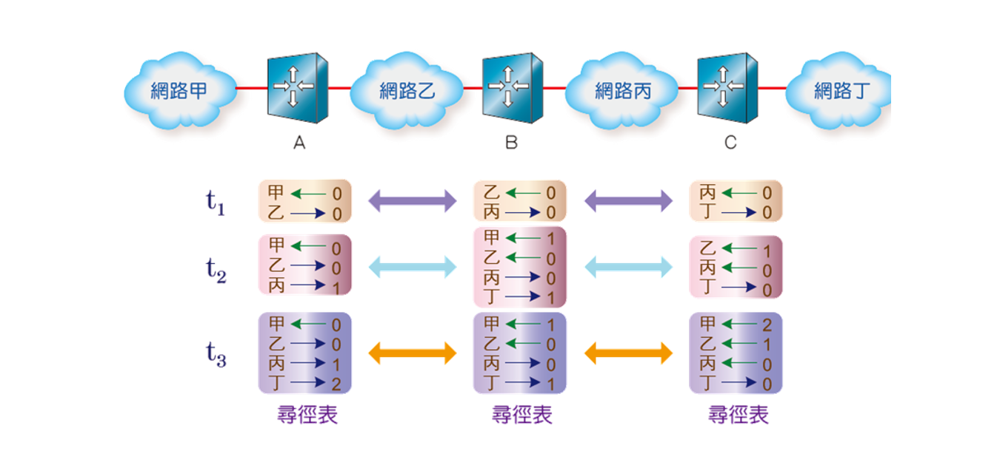
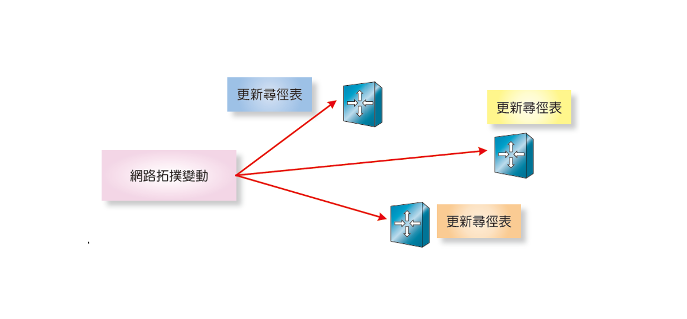

## 動態尋徑協定
* 在不同路由器間不斷交換路徑資訊，達成路徑更新，找出最短交換路徑，分為以下三種

### 距離向量協定
> 相鄰路由器間週期性交換路徑資訊
>以自身為起點，直接相連的路由器距離為0，間隔一個路由器距離為1，以此類推，建立自己的尋徑表，再和相鄰路由器，交換資訊，取代距離較長的部分，建構最短路徑的尋徑表 

* 特點：資料傳輸量大，維護成本高，收斂速度慢，只適合小型網路

### 連線狀態協定
 > 每個路由器都進行泛播將路由資訊傳送給所有路由器，建立資料庫，再透過最短尋徑法，完成路由表的建置，只有在拓譜有變時，再將新路徑資訊傳給其他路由器。

#### 想像一下
> 就像在玩遊戲時，你要選一個基地，周圍都是黑暗的，你要派人四處打開地圖，發現別人的基地，需要時間精力。調查完後，只要在發生事件後在更新地圖，再把地圖告訴別人就好，其他時間都沒事。

* 特點：在最初建置時消耗大量資源，平時維護成本低，在拓譜變動時，才會更新，收斂時間短。

### 混合式尋徑協定

>混合式尋徑協定：採用目的最佳路徑表，和路徑變動時才更新。因此更新和建立都只要較短的時間。