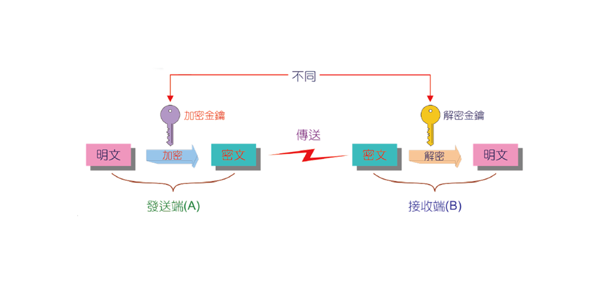
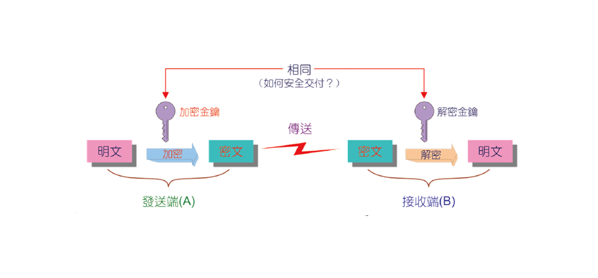

# 網路安全

## 資安的目標(CIA)
>**C** onfidentiality  
機密性  
**I** ntegrity 
完整性  
**A** vailability  
可用性   

## 防火牆(Firewall)
> 保護內部資訊不受外部攻擊的系統
 
### 機制
>**白名單**:預設全員drop，在名單上者才能通過      
>**黑名單**:預設全員permit，在名單上者不能通過 

### 種類
>**封包過濾式**:在OSI架構中的2,3,4層進行，以封包的標頭資料(例如 SRCIP、DSTIP、封包類型、埠號...)進行過濾  
>**應用閘道器**:建立在第7層應用層，客戶端與伺服器或網路與網路之間，檢查是否建立連結，建立後，由應用閘道器代理轉送資料，因此又稱為代理伺服器(proxy server)，可進行較為嚴謹的控管   

## 加密(Encryption)
| 项目        | 公開金鑰系統   |  秘密金鑰系統  |
| -----        | :-----:  | :----:  |
|  加解密金鑰      |   不同   |   相同   |
| 效能     | 較差      |    較好    |
|   計算複雜度       |   較複雜   |  較簡單     |
|  常見系統       |   RSA、DSA、SHA|   DES、FEAL、IDEA    |

### 公開金鑰系統 

### 秘密金鑰系統
