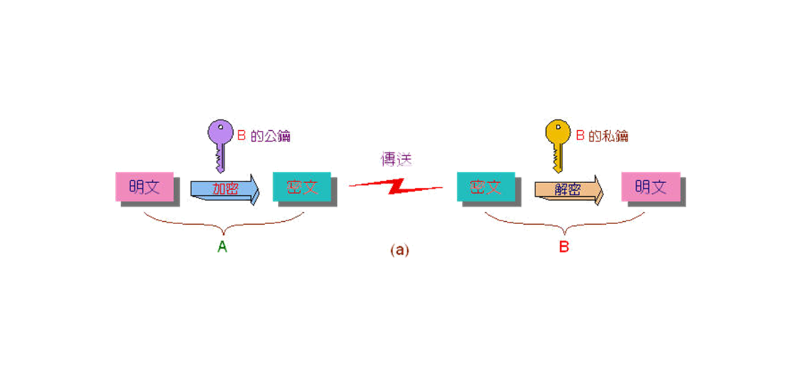
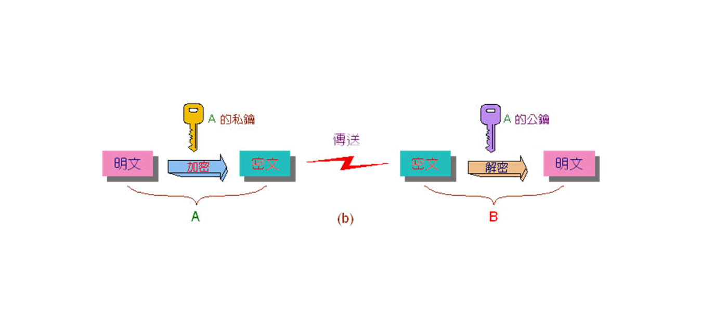
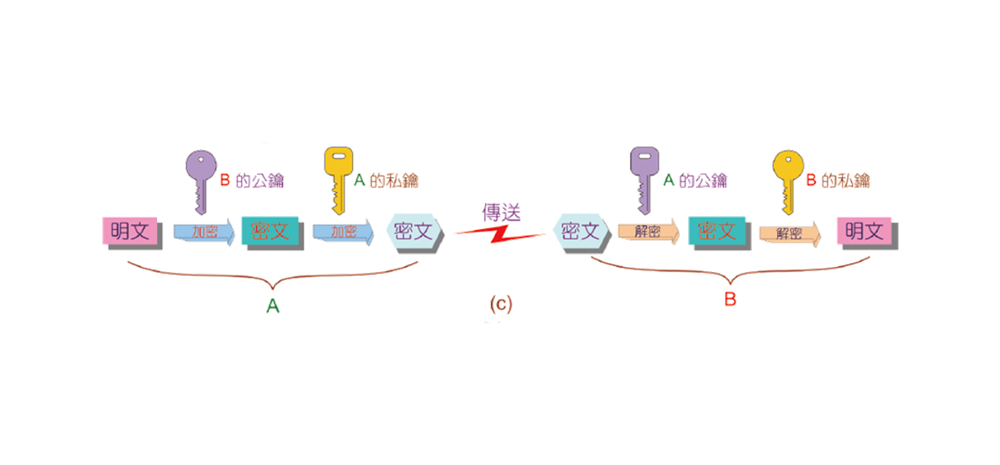

# 網路安全

## 資安的目標(CIA)
>**C** onfidentiality  
機密性  
**I** ntegrity   
完整性  
**A** vailability  
可用性   

## 防火牆(Firewall)
> 保護內部資訊不受外部攻擊的系統
 
### 機制
>**白名單**:預設全員drop，在名單上者才能通過      
>**黑名單**:預設全員permit，在名單上者不能通過 

### 種類
>**封包過濾式**:在OSI架構中的2,3,4層進行，以封包的標頭資料(例如 SRCIP、DSTIP、封包類型、埠號...)進行過濾  
>**應用閘道器**:建立在第7層應用層，客戶端與伺服器或網路與網路之間，檢查是否建立連結，建立後，由應用閘道器代理轉送資料，因此又稱為代理伺服器(proxy server)，可進行較為嚴謹的控管   

## 加密(Encryption)

### 要點
> **C** onfidentiality  
機密性       
>**I** ntegrity  
完整性  
>**N** on-**R** epudiation  
不可否認性  

| 项目        | 公開金鑰系統   |  秘密金鑰系統  |
| -----        | :-----:  | :----:  |
|  加解密金鑰      |   不同   |   相同   |
| 效能     | 較差      |    較好    |
|   計算複雜度       |   較複雜   |  較簡單     |
|  常見系統       |   RSA、DSA、SHA|   DES、FEAL、IDEA    |

### 公開金鑰系統 

### 秘密金鑰系統

## 雜湊函數(Hash Function)
>透過特殊算法將資料轉換成另一組數值（雜湊值），用來保證資料完整性與正確性	
> 常見的有MD4、MD5、SHA

## 認證(Authentication)

* (一).Ａ用Ｂ的公鑰加密，Ｂ用Ｂ的密鑰解密：確保資料隱密性，但不知道發送來源

* (二).Ａ用Ａ的密鑰加密，Ｂ用Ａ的公鑰解密：確保資料來源，但不保證安全性

* (三).結合（一）（二）種方法，保證隱密性和來源，但速度較差

### 數位簽章(Digital Signature)
>類似印章，代表自己的身分

### 數位憑證(Digital Certificate)
>具有權威機關認可的證件

## 入侵偵測系統（ＩＤＳ）
> 在遭受駭客攻擊時能在最短時間內提出警告，與防火牆不同，不會主動攔截可能的攻擊，須建立已知攻擊模式的資料庫，遭遇新的攻擊便可記錄，使防禦系統更加完善，但當下無法立即對新種攻擊做出反應。

### 主機型ＩＤＳ
> 建立在主機上，由於資料進入主機已解密，因此可避免無法監聽的問題
，缺點是消耗硬體資源，且每台主機皆須單獨安裝，成本較大。

### 網路型ＩＤＳ
> 在網路中對流量進行監聽，與資料庫比對，篩選出可疑封包，缺點是無法在加密狀態和交換式網路下監聽，無法得知入侵是否成功