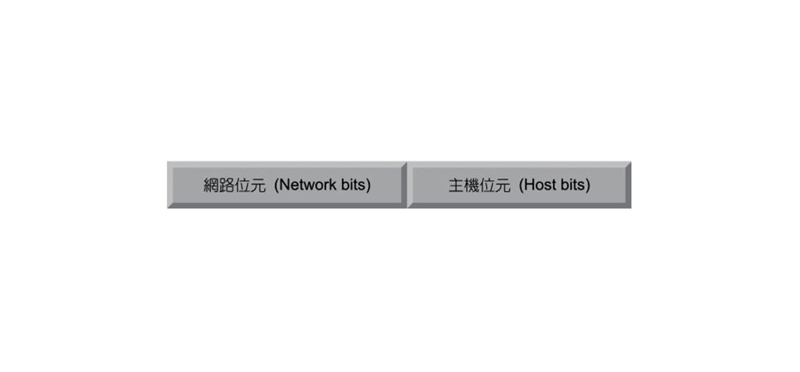
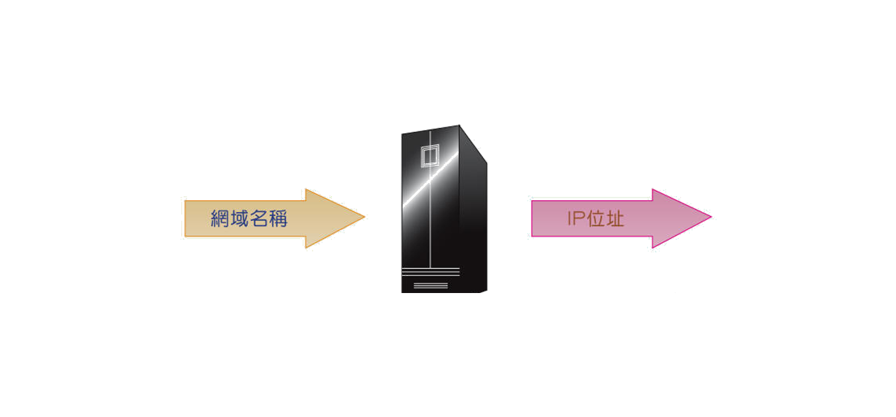
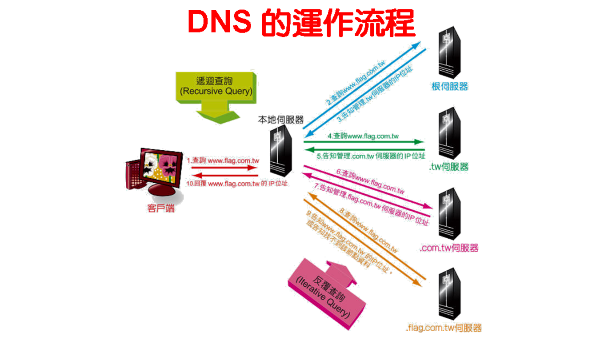
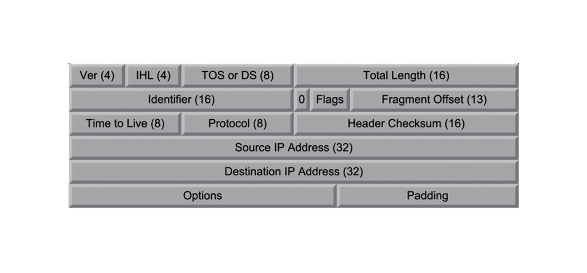
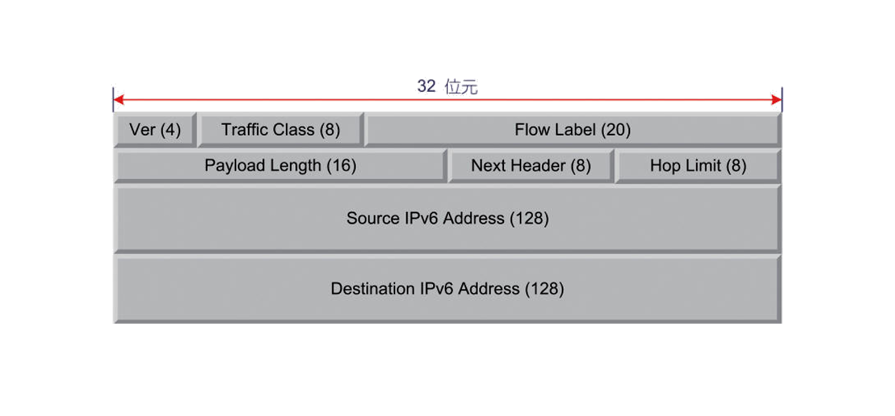

## IP位址
* 每台電腦都在連網時都需要一連串數碼用以**表明身分**，IP協定所規範的數碼，即為IP位址。
## IPv4
* IP協定第四版，目前主流運用的版本
* 總長度**32位元**，約**四十三億**個位址
* **8位元**為**1單位**，分**4**部分，以十進位表示
* 分為**網路位元**和**主機位元**
 
>網路位元 : 辨識IP位址是屬於哪一個網路系統   
>主機位元 : 辨識IP位址是屬於哪一個電腦主機   

## DHCP（動態主機設定協定）
>**D** ynamic 
>**H** ost 
>**C** onfiguration 
>**P** rotocol　
### 
* IP位址有限，無法給每台主機都分配一個永久位址，在需要連線時向server索取**有時限位址**
### 步驟(DORA) 

>**D** iscover   
客戶端**找到**"伺服端  
  
>**O** ffer		    
伺服端**提供**位置給客戶端  
  
>**R** equest		    
>客戶端**請求**使用某IP位址  

>**A** cknowledge		    
>伺服端**確認**  

## DNS(網域名稱系統)

>**D** omain 

>**N** ame 

>**S** ystem 
### 
* 由數字組成的位址不易觀看與辨識，賦予節點特定名稱方便理解
* 但在網路中進行通訊依然是用**IP位址**，所以要在兩者間進行轉換
 

* 由**網域名稱** 查 **IP位址** 為**正向名稱查詢**
* 由**IP位址** 查 **網域名稱** 為**反向名稱查詢**
## FQDN(完整網域名稱)
> **F** ully 

> **Q** ualified 

> **D** omain 

> **N** ame 

* 以階層組成，用 **.**  區隔，最多五層 

###主要分為三部分 

**www.google.com** 

* 主機名稱(www) 
* 網域名稱(google.com) 
* 網域 "." 
> 常將其省略 

## DNS 運作流程 
 

##IPv4  
>**I** nternet 

>**P** rotocol 

>**v** erson **4**  
 
 ### IP標頭  

  * IP協定在網路通訊時所需的訊息 
 

* Ver(4 bits):版本  
 > IPv4在此欄為(0100) 
 > IPv6在此欄為(0110) 
 
* IHL(Internet Header Length; 4 bits):標頭長度 
 > 32位元為1單位 
 > 若標頭長度為160位元，則為5單位，欄位值為(0101) 

* TOS or DOs(8 bits):服務類型或差異服務 
 > 定義IP封包的服務類型 
 > 僅具參考用  

* TL(16 bits):封包總長度 
 > IP標頭與資料總和長度 
 > 最長可達65535(2^16-1)位元組 

* ID(16 bits):識別代碼 
 > 當封包超過最大傳輸限制，進行分割傳送 
 > 此代碼在重組時用來辨識 
 
* FL(3 bits):旗幟辨識 
 > 最左為0 
 > 其次DF(Don't Fragment)，為0代表可切割，為1代表不可切割  
 > 最後為MF(More Fragment)，為0代表是此封包最後的分片，為1代表不是 

* FO(13 bits):分片位移 
 > 記錄所有分片封包原本的位置 

* TTL(8 bits):存活時間 
 > 以秒為單位 
 > 最大存活時間為255(2^8-1)秒 
 > 為0時，封包自動捨棄 
  
* PROT(8 bits):網路協定 
 > 紀錄傳輸層使用的網路協定 

* HC(16 bits):標頭檢查碼 
 > 檢查標頭內的傳輸是否都正確 

* SA(32 bits):來源端IP 
 > 來源端主機IP 

* DA(32 bits):目的端IP 
 > 目的端主機IP 

* OPT(長度不定):選擇項 
 > 用來測試與除錯 
 > 非絕對必要 

## IPv6 
克服IPv4的缺點 
> **位址不足** : 增加到128位元，比Pv4多2^96倍 

> **標頭簡化** : 固定標頭長度，提高處理效能 

> **延伸標頭與選擇項** : 選擇項放入延伸標頭，提升轉送效能 

###IPv6標頭 
 
 
* Ver(4 bits):版本  
 > IPv4在此欄為(0100) 
 > IPv6在此欄為(0110) 

* Traffic Class(8 bits):訊務等級  
 > 相當IPv4中的**TOS or DS**欄位 

* Flow Valbel(20 bits):流量標籤  
 > 配合封包進行分類傳送 

* Payload Length(16 bits):承載資料長度  
 > 相當於IPv4中的**Total Lenhth**欄位 
 > 由於IPv6標頭固定，只計算資料長度 

* Next Header(8 bits):下一個標頭  

* Hop Limit(8cbits):最大節點數 
 > 相當於IPv4中的**TTL**欄位 
 > 以節點為單位 

* Source IPv6 Address(16 bits):來源端IPv6位址 
 > 來源端主機位址 

* Destination IPv6 Address(16 bits):目的端IPv6位址 
 > 目的端主機位址 

