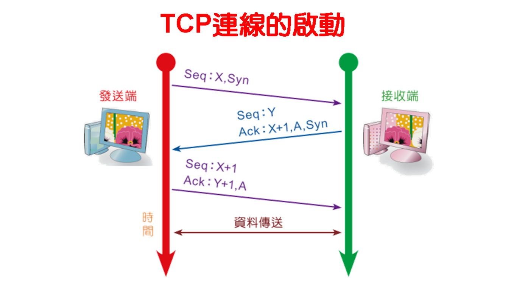
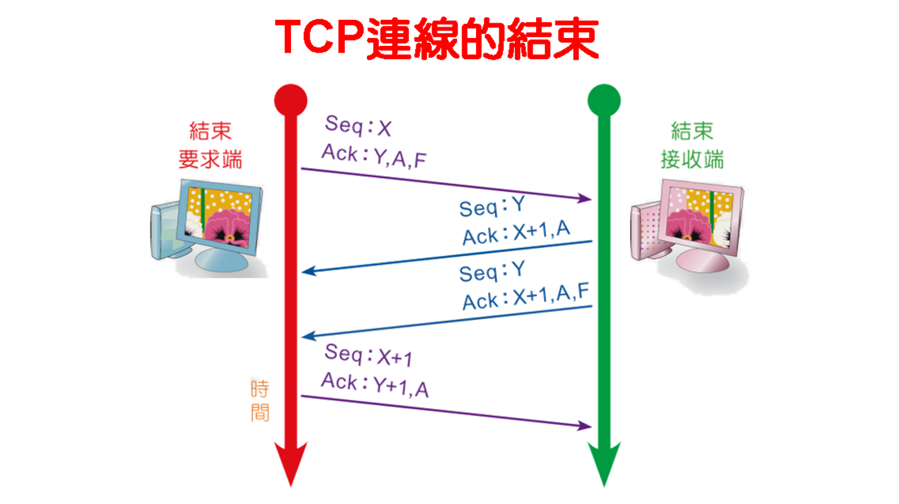

# 傳輸層協定

| 项目        | TCP   |  UDP  |
| -----        | :-----:  | :----:  |
|  可靠度      |   高   |   低   |
| 處理時間     | 較長      |   較短     |
|   特性       |   三項交握、流量控制、緩衝區、滑動視窗   |    講求速度  |
| 標頭長度     |    20bytes            |  8bytes  |
|  PROT       |   6                   |    17       |

## TCP 
### 連線 

### 關閉 
